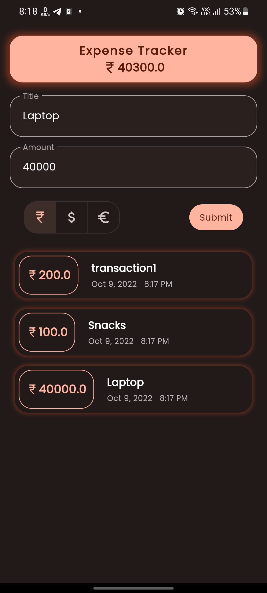

# Expenses Tracker
This app keeps track of your expenses

## Features
```
* Uses Material v3 monet engine for dynamic wallpaper based color 🎨 palette (For Android 12)

* Auto dark 🌙 mode
```


## Screenshots


## Installation
* Make sure install <a href="https://flutter.dev" flutter>flutter sdk</a> first.
* run `flutter doctor` in terminal/cmd
* clone the repo and run `flutter pub get` to install all dependencies.
* run `main.dart` for any platform and 🚀