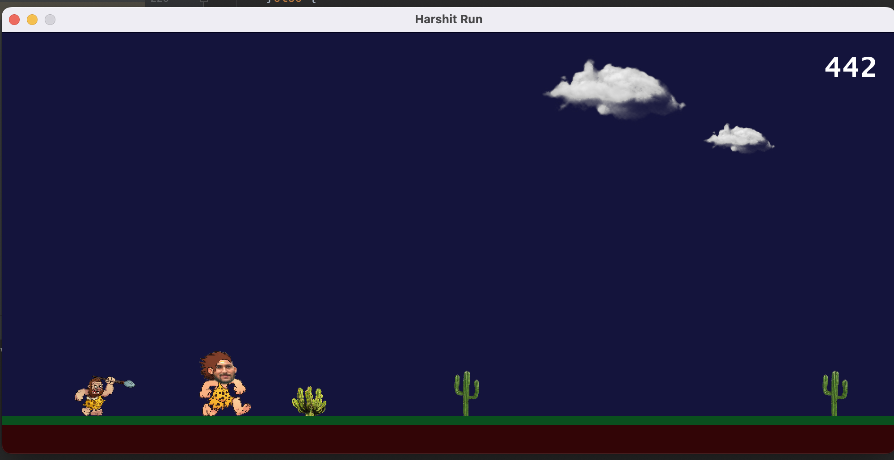
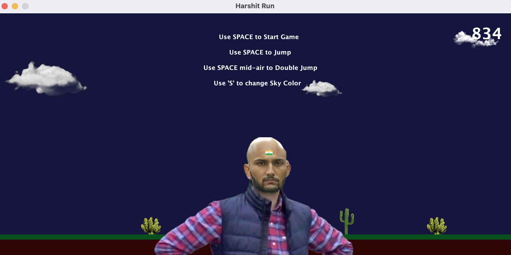

# Harshit-Run
-> A basic Java game made using Swing
 
-> This is an unlimited running game

# Screenshots

 

    <h6>Running Harshit</h6>
     

 

    <h6>Losing Screen</h6>
     

 

# Features

1. The game runs indefinitely.
2. Obstacles appear at random
3. You have to jump and avoid touching the obstacles

# Controls

 
Though controls can be seen on the starting screen and losing screen, they are as following

-- USE SPACE --
 
-> Space to jump  
-> Space When mid-air, you can use double jump once, before landing the ground  
-> Space to start a new run, when game over  

# How to Run?

1. Fork the project or Simply download your copy of code
2. Make Sure You Have JDK/JVM Installed - (You can check if you have node by typing {java --version} in terminal)
3. Open the Folder in Terminal
4. You can even skip to step 8, if you don't want to compile your code, just goto out/production/harshit-run and....goto step 8
5. Navigate to src folder by typing { cd src/ }
6. Then type and run { javac Main.java } to compile the code
7. A new Main class file along with other 2 classes files must be created
8. Now run the 'Main' file by typing { java Main }

Enjoy
Make sure to raise any issues and even contribute

