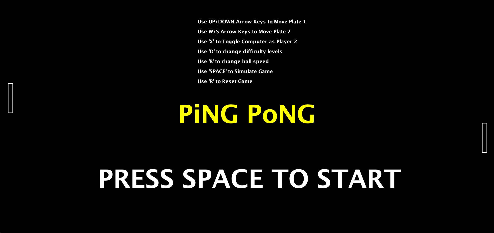
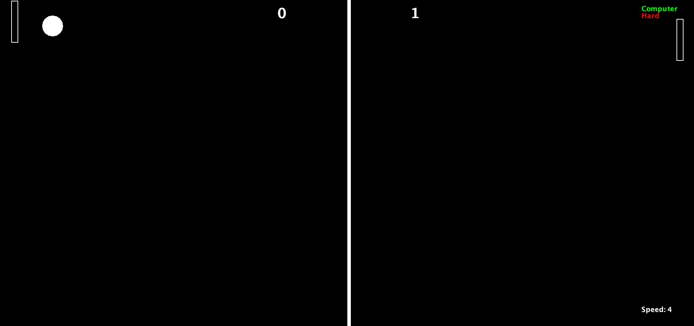

# PingPong
Ping Pong game with Play with Computer Feature

# Features

1. Can play against computer ( 'X' Key)
2. Can also play double player (By Default)
3. Can change ball speed ( 'B' Key)
4. Ability to restart at any time
5. Also has a simulation mode where both players are CPUs ('Space' Key)
6. Has 3 Difficulty levels against CPU

# Screenshots

 

    <h6>Starting Screen</h6>
    </img> 

 

 

    <h6>Against Computer</h6>
    </img> 

 

# Controls

when Playing 2 Players,

-- For Player 1 --

use Arrow UP - To Move Up

use Arrow DOWN - To Move Down

-- For Player 2 --

use W - To Move Up

use S - To Move Down
 
---GENERAL CONTROLS---

USE X -> To Toggle Compter For Player 2

USE D -> To change difficulty level

USE 'SPACE' to Simulate Game

USE 'B' to change Ball speed

# How to Run?

1. Fork the project or Simply download your copy of code
2. Make Sure You Have JDK/JVM Installed - (You can check if you have node by typing {java --version} in terminal)
3. Open the Folder in Terminal
4. You can even skip to step 8, if you don't want to compile your code, just goto /compiled and....goto step 8
5. Navigate to src folder by typing { cd src/ }
6. Then type and run { javac Main.java } to compile the code
7. A new Main class file along with other 2 classes files must be created
8. Now run the 'Main' file by typing { java Main }

Enjoy
Make sure to raise any issues and even contribute

